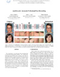
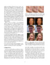
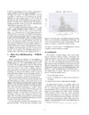
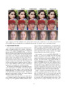
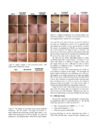
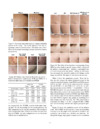
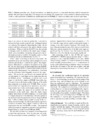
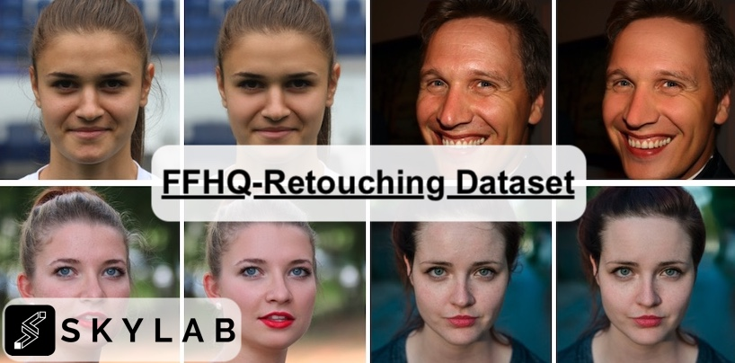

---
# Feel free to add content and custom Front Matter to this file.
# To modify the layout, see https://jekyllrb.com/docs/themes/#overriding-theme-defaults

layout: home
title: Home
---

- [Publications](#publications)
  - [WACV 2021 -- AutoRetouch: Automatic Professional Face Retouching](#wacv-2021----autoretouch-automatic-professional-face-retouching)
- [Datasets](#datasets)
  - [Flickr-Faces-HQ-Retouching (FFHQR) Dataset](#flickr-faces-hq-retouching-ffhqr-dataset)
- [Job Opportunities at Skylab Machine Lerning Team](#job-opportunities-at-skylab-machine-lerning-team)

## Publications

### WACV 2021 -- AutoRetouch: Automatic Professional Face Retouching

**AutoRetouch: Automatic Professional Face Retouching** 
Alireza Shafaei ([skylabtech](https://www.skylabtech.ai)), James J. Little (UBC), Mark Schmidt (UBC) 
Winter Conference on Applications of Computer Vision (WACV), 2021 
[WACV 21 Page](https://openaccess.thecvf.com/content/WACV2021/html/Shafaei_AutoRetouch_Automatic_Professional_Face_Retouching_WACV_2021_paper.html){:target="_blank"}
• [PDF](https://openaccess.thecvf.com/content/WACV2021/papers/Shafaei_AutoRetouch_Automatic_Professional_Face_Retouching_WACV_2021_paper.pdf){:target="_blank"}
• [Supp](https://openaccess.thecvf.com/content/WACV2021/supplemental/Shafaei_AutoRetouch_Automatic_Professional_WACV_2021_supplemental.pdf){:target="_blank"}

## Datasets

### Flickr-Faces-HQ-Retouching (FFHQR) Dataset

Flickr-Faces-HQ-Retouching (FFHQR) is a high-quality image dataset of retouched human faces for computer vision research.

[[FFHQR -- Visit Github]](https://github.com/skylab-tech/ffhqr-dataset){:target="_blank"}

The retouching dataset is made available under [Creative Commons BY-NC-SA 4.0](https://creativecommons.org/licenses/by-nc-sa/4.0/){:target="_blank"} license by [Skylab Technologies Incorporated](https://skylabtech.ai){:target="_blank"}. You can **use, redistribute, and adapt it for non-commercial purposes**, as long as you (a) give appropriate credit by **citing our paper**, (b) **indicate any changes** that you've made, and (c) distribute any derivative works **under the same license**.

## Job Opportunities at Skylab Machine Lerning Team

Do you wish to join the machine learning team at Skylab to perform cutting-edge computational photography research?
We have _full-time_, _part-time_, and _internship_ positions available in Vancouver, Canada.
Just send your CV and preference (full-time/part-time/internship) to [ml@skylabtech.ai](mailto:ml@skylabtech.ai).
